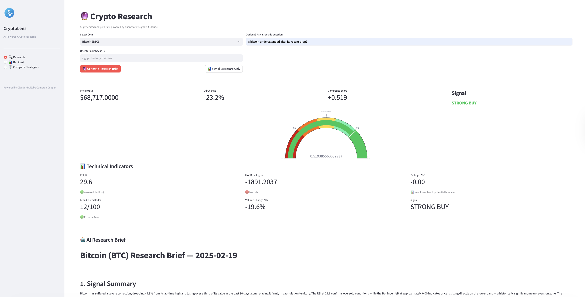
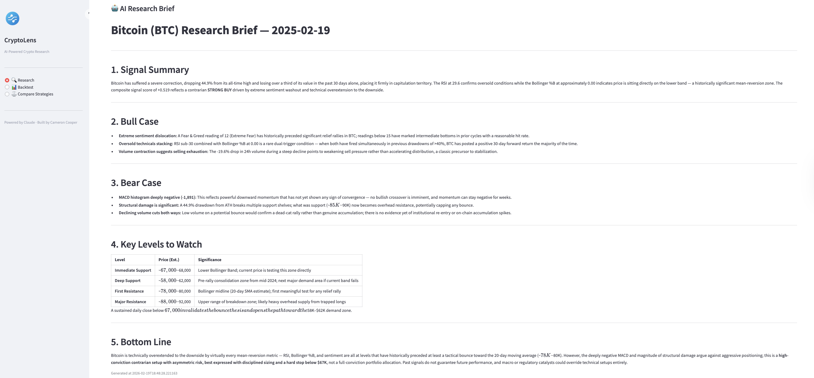
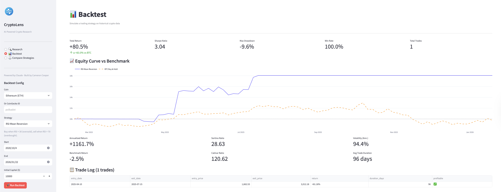
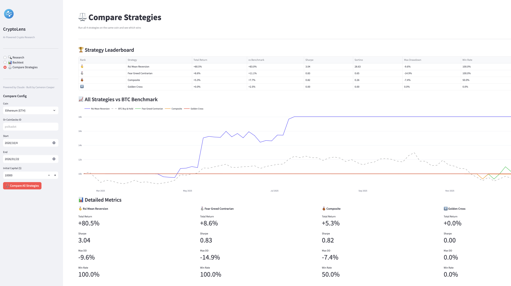

# CryptoLens 🔮

An AI-powered crypto research platform combining quantitative signal analysis with Claude-generated analyst briefs.

   

## What it does

- **Signal Scorecard** — computes RSI, MACD, Bollinger Bands, OBV, and a composite score (-1 to +1) for any tracked coin, plus crypto-specific signals: Fear & Greed index and 24h volume change
- **AI Research Briefs** — Claude reads the signal data and writes a structured analyst brief with signal summary, bull case, bear case, key levels, and bottom line
- **Backtesting Engine** — simulate 4 trading strategies with full metrics: Sharpe, Sortino, Calmar, max drawdown, win rate, equity curve vs BTC benchmark
- **Strategy Comparison** — run all 4 strategies on the same coin and see a ranked leaderboard with combined equity curves

## Stack

- **Backend:** FastAPI + SQLAlchemy + PostgreSQL (Supabase)
- **Data:** CoinGecko API (price/OHLCV) + Alternative.me (Fear & Greed index)
- **Signals:** pandas, numpy, ta (technical analysis)
- **AI:** Anthropic Claude API
- **Frontend:** Streamlit + Plotly

## Architecture

```
cryptolens/
├── app/
│   ├── api/              # FastAPI route handlers
│   │   ├── coins.py      # Coin management + seeding
│   │   ├── signals.py    # Signal computation endpoints
│   │   ├── backtest.py   # Backtesting endpoints
│   │   └── research.py   # AI research brief endpoints
│   ├── core/             # Config + settings
│   ├── db/               # SQLAlchemy models + session
│   ├── models/           # Pydantic request/response schemas
│   └── services/
│       ├── ingestion.py  # CoinGecko data pipeline
│       ├── signals.py    # Quant signal engine
│       ├── backtester.py # Strategy backtesting engine
│       └── research.py   # Claude-powered research layer
├── frontend/
│   ├── app.py            # Streamlit entry point
│   └── views/            # Research, Backtest, Compare pages
├── scripts/              # CLI tools for seeding and running
└── main.py
```

## Setup

**Prerequisites:** Python 3.11, PostgreSQL (or Supabase free tier)

```bash
# 1. Clone
git clone https://github.com/camczc/cryptolens.git
cd cryptolens

# 2. Create virtual environment
python3.11 -m venv venv
source venv/bin/activate

# 3. Install dependencies
pip install -r requirements.txt

# 4. Configure environment
cp env.example .env
# Edit .env — add DATABASE_URL and ANTHROPIC_API_KEY

# 5. Initialize database
python scripts/init_db.py

# 6. Seed price history (CoinGecko free tier, no API key needed)
python scripts/seed_data.py --coin bitcoin ethereum solana binancecoin

# 7. Compute signals
python scripts/run_signals.py --coin bitcoin ethereum solana binancecoin
```

## Running

```bash
# Terminal 1 — API server
uvicorn main:app --reload

# Terminal 2 — Streamlit dashboard
python -m streamlit run frontend/app.py
```

- **Dashboard** → http://localhost:8501
- **API Docs (Swagger)** → http://localhost:8000/docs

## API Endpoints

| Method | Endpoint | Description |
|--------|----------|-------------|
| GET | `/signals/{coin}` | Latest signal scorecard |
| POST | `/signals/{coin}/compute` | Recompute signals |
| GET | `/analyze/{coin}` | Claude research brief |
| POST | `/backtest` | Run a strategy backtest |
| POST | `/backtest/compare` | Compare all strategies |
| GET | `/coins` | List tracked coins |
| POST | `/coins/{coin}/seed` | Seed price history |

## Strategies

| Strategy | Logic | Best for |
|----------|-------|----------|
| Composite | Weighted aggregate of RSI + MACD + Bollinger + Fear&Greed | General use |
| RSI Mean Reversion | Buy RSI < 30, sell RSI > 70 | High-volatility crypto |
| Golden Cross | SMA50 vs SMA200 crossover | Trending markets |
| Fear & Greed Contrarian | Buy extreme fear (< 25), sell extreme greed (> 75) | Sentiment-driven moves |

## Environment Variables

```
DATABASE_URL=postgresql://...     # PostgreSQL connection string
ANTHROPIC_API_KEY=sk-ant-...      # Required for AI research briefs
ENV=development
LOG_LEVEL=INFO
```

## Data Sources

- **CoinGecko** — OHLCV price history, market cap (free, no API key required)
- **Alternative.me** — Fear & Greed index history (free)

## Demo

| Research & Signals | AI Research Brief |
|---|---|
|  |  |

| Backtest Results | Strategy Comparison |
|---|---|
|  |  |
